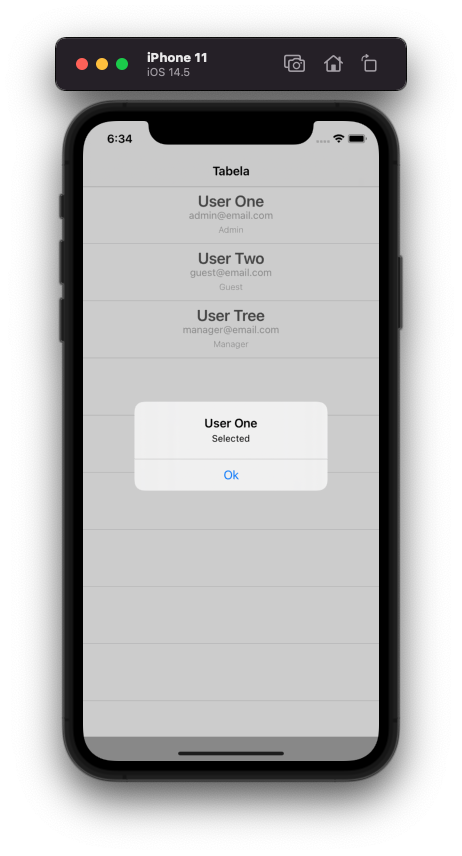

## TableViewApp Demo

An tableview app made with view code

    
    

    
    

### Concepts used

- Swift
- UIKit
- ViewCode
- UINavigationController
- UITableView Component
- Custom UITableViewCell
- AutoLayout Constraints
- UITableView Delegates
- Alerts and Actions
